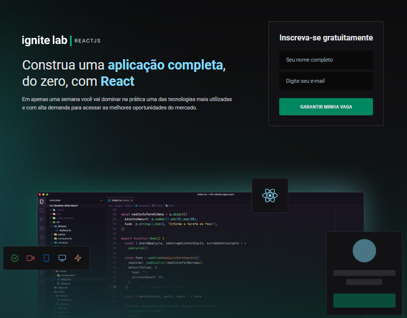

<h3>Demo: https://event-platform-santarelle.vercel.app/</h3>

<h1 align="center">
  
</h1>

<h3 align="center">
  A web platform to subscribe and watch event videos
</h3>

<p align="center">
  
  
  
  
  <a href="https://github.com/santarelle/recipe-app/commits/master">
    
  </a>
  
  <a href="https://github.com/santarelle/recipe-app/issues">
    
  </a>
</P>

<p align="center">

  <a href="https://github.com/santarelle" target="_blank">
    
  </a>
  <a href="https://github.com/santarelle" target="_blank">
    
  </a>
  <a href="https://br.linkedin.com/in/marco-santarelle-da-silva-jardim-csm-cspo-csd-78b21066" target="_blank" >
    
  </a>
  <a href="mailto:santarelle@gmail.com" target="_blank" >
    
  </a>
</p>

<p align="center">
  <a href="#computer-languages">Languages</a>&nbsp;&nbsp;&nbsp;|&nbsp;&nbsp;&nbsp;
  <a href="#books-technologies">Technologies</a>&nbsp;&nbsp;&nbsp;|&nbsp;&nbsp;&nbsp;
  <a href="#install">Install</a>&nbsp;&nbsp;&nbsp;|&nbsp;&nbsp;&nbsp;
  <a href="#books-usage">Usage</a>&nbsp;&nbsp;&nbsp;|&nbsp;&nbsp;&nbsp;
  <a href="#user-stories">User Stories</a>&nbsp;&nbsp;&nbsp;
</p>

## :computer: Languages

- **TypeScript**

## :books: Technologies

- **React**
- **Vite**
- **GraphQL**
- **Apollo GraphQL Client**
- **GraphCMS**
- **GraphQL Code Generator**
- **TailwindCSS**
- **PostCSS**
- **Vercel**

## Install

```sh
npm install
```

## Usage

```sh
npm run dev
```

## User Stories
-   User can subscribe to the event
-   User can see events registered
-   User can see an event with video, detail, teacher

## Author

👤 **Marco Jardim**

* Github: [@santarelle](https://github.com/santarelle)
---

Made by :heartbeat: by [Marco Jardim](https://github.com/santarelle)